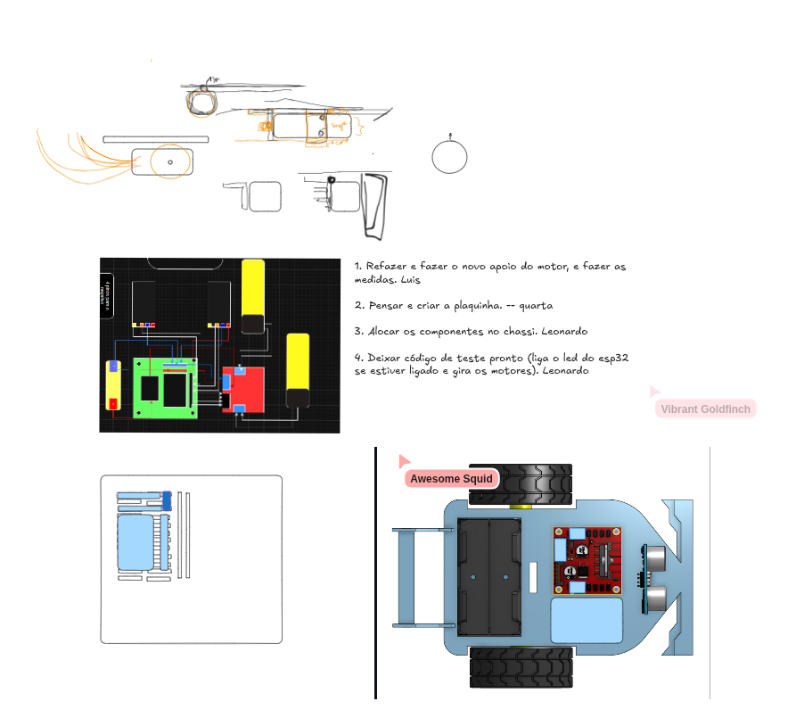

# Entrega 02 - Projeto do Circuito

## Procedimento 

Primeiramente analisamos o datasheet de cada componente, para analisar qual seriam as conexões e placas a serem criadas para o projeto. Além disso, notamos a necessidade de alterar o suporte para o motor, já que ele não considerava a presença do encoder, que altera a altura do motor por causa da engrenagem. A partir disso, obtivemos alguns rascunhos.

## Circuito

Fotos do esquemático:

Fotos do circuito:

***

### Alimentação e placa do ESP32-C3-Mini:

***

### Encaixe dos motores e encoders:

***
### Encaixe dos componentes:

