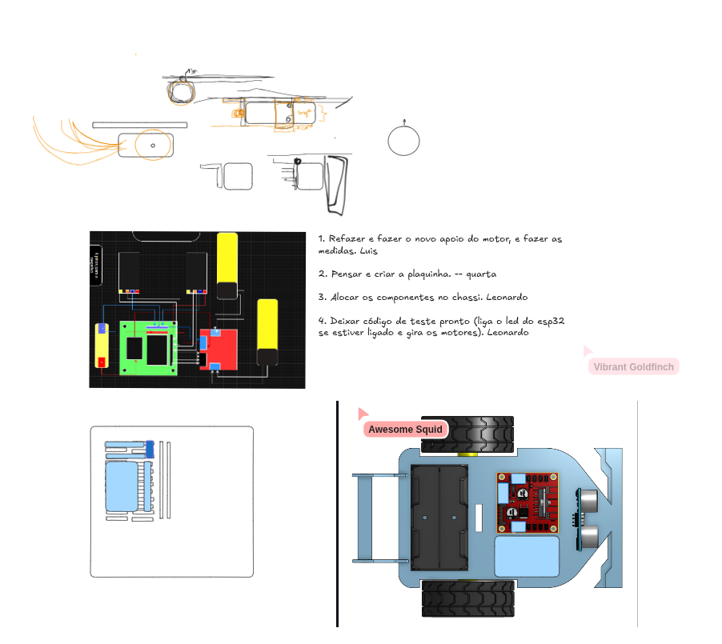
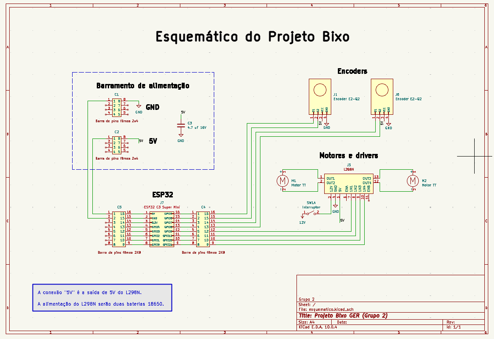
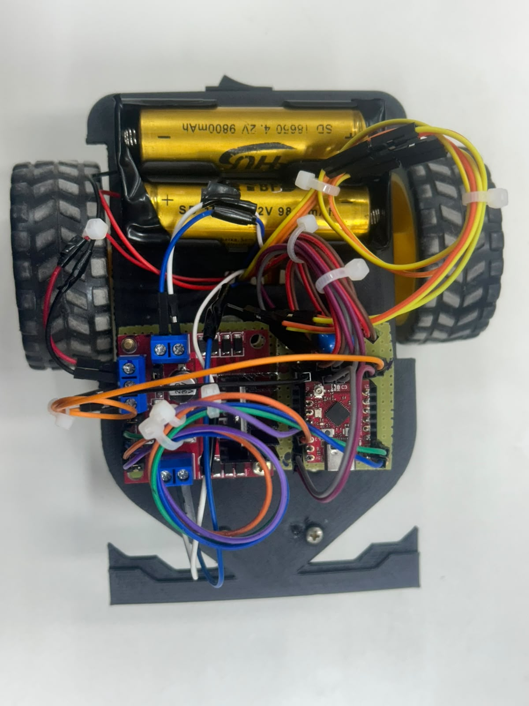
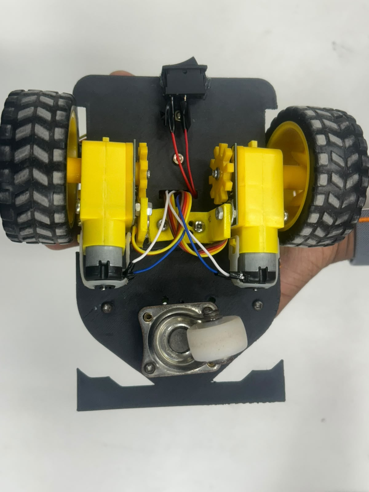
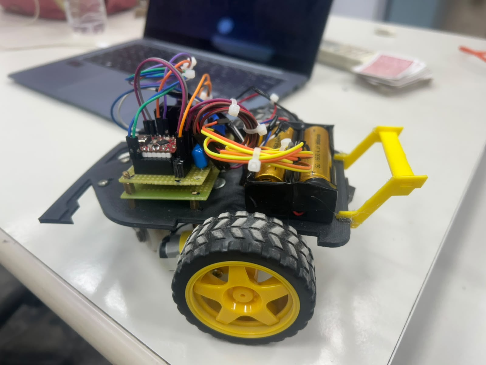

# Entrega 02 - Projeto do Circuito

## Introdução

Primeiramente analisamos o datasheet de cada componente, para analisar qual seriam as conexões e placas a serem criadas para o projeto. Além disso, notamos a necessidade de alterar o suporte para o motor, já que ele não considerava a presença do encoder, que altera a altura do motor por causa da engrenagem. A partir disso, obtivemos alguns rascunhos. 

## Circuito

Fotos do esquemático:

Fotos do circuito:

***

### Alimentação:
A alimentação do circuito 'dividida em duas partes: 8V e 5V. 
- **8V:** alimentação da ponte H (L298N), feita através de duas pilhas 18650. As pilhas são colocadas em um suporte e a parte positiva desse conjunto é seccionado através de um interruptor que permite ligar ou desligar o robô.
- **5V:** alimentação do Esp32-C3 Super mini e dos Encoders. Ela advém do pino de +5V fornecido pela ponte H e do GND do robô, que são conectados em um barramento de alimentação (2x4 fêmea para cada). 

***

### Encaixe dos motores e encoders:
Para encaixar os motores e encoders, sofremos algumas dificuldades devido ao subdimensionamento dos suportes, já que não consideramos as engrenagens dos encoders. No entanto, conseguirmos resolver resolver esse problema utilizando uma sucata de impressão 3D, que possui uma altura adequada para ser encaixada entre os suportes e o chassi. Sendo assim, parafusamos esse conjunto. Outra dificuldade enfrentada foi a quebra de um dos suportes, que foi consertada utilizando um L em formato metálico, parafusando uma parte dele no suporte e a outra no chassi. Uma observação pertinente é que não foi possível imprimir novos suportes devido a falta de tempo e o não funcionamento da impressora no período.

***
### Encaixe das placas:
Para encaixar das placas, cortados uma placa ilhada em um tamanho adequado e montamos ela em cima do chassi, utilizando extensores, de tal forma que ela ficasse elevada. Isto é, pois haviam parafusos na parte inferior do espaço onde ficariam as placas. Após isso, montamos as placas no apoio com uso de porcas e parafusos, buscando fixar no mínimo 2 pontos de apoio. Além disso para o ESP32-C3 Super Mini, criamos uma placa com um barramento para todos os pinos do ESP, a fim de dar mias flexblidade no projeto, já que as conexões não permenantes permitem o teste de diferentes topologias.

***
### Procedimento:
Para os furos nas placas utilizamos a  furadeira de mão e de bancada, com pontas variando de 2mm a 4mm. Para fixar alguns componentes, como o aerofólio e o interruptor utilizamos cola quente. Para soldar os componentes, utilizamos a estação de solda, estanho e a fita de cobre. Por fim, para fixar os componentes, utilizamos porcas e parafusos, e para estruturas que necessitavam de muita pressão, inserimos aruelas entre as porca e parafusos para distribuir a pressão, não danificando o chassi.
